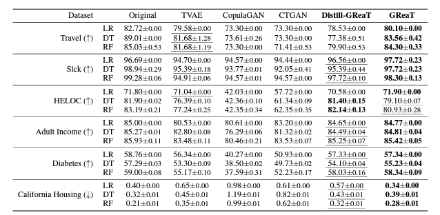

# synthetic-data-generation

We will covering Synthetic data generation using :

1. **LLM**
2. **Synthetic data vault**

1. **LLM** : In this we are going leverage the `distilGPT2` model and `be_great` package to generate the synthetic tabular data.

**GReaT** stands for 
**Generation of Realistic Tabular data**
with pretrained Transformer-based language models
Following is claim of the authors and we can see that it is performing better than CouplaGAN and CTGAN

2. **Synthetic data vault**: This library provides option to generate synthetic data using mutiple algorithm.

    2.1 **GaussianCoupla**: Helps modeling complex relationships between variables 

    2.2 **CTGAN** (Conditional Transform Generative Adverserial Network)

    2.3 **PAR** (Probabilistic Autoregressive for Time-Series or Sequence data) 